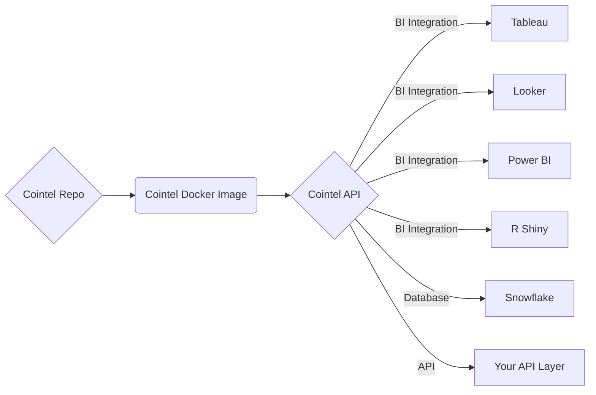

## Cointel's Tech Docs

# Software Products & Lifecycles
| Product | Description | Product Lifecycle |
|---|---|---|
| [cointel-api](https://cointel-api.herokuapp.com/__docs__/) | 💡 Cointel's Free Api | production |
| [cointel-app](https://github.com/cointelfinance/cointel-api) | ⏬ Cointel's App | beta |
| [request-cointel](https://github.com/cointelfinance/request) | ✅ Request a Cointel Account | production |

# Python Package
[cointelPY](https://github.com/cointelfinance/cointelPY)

# R Package
[cointelR](https://github.com/cointelfinance/cointelR)

# Software as a Service Infrastructure

